  

  

  
  
  
  
  

  

### 👨‍💻 About Me

<table border="0" width="100%">
  <tr>
    <td width="22%" align="center" valign="middle" style="padding: 16px 14px;">
      
        
      <b style="font-size: 16px; color: #FFFFFF;">Umar Farooq</b> 
      Software Engineer 
      @ Parallel Loop 
      📍 Lahore, Pakistan
    </td>
    <td width="78%" valign="top" style="padding: 16px 20px;">
      

        Hey, I'm Umar 👋 
        I'm a <b>Full Stack Engineer</b> at <a href="http://parallelloop.io/"><b>Parallel Loop</b></a> with 3+ years of experience engineering production SaaS platforms, business automation engines, and scalable web architectures — from low-latency databases up to responsive UIs.
      

      

        My core production stack centers on <b>React.js</b>, <b>Node.js</b>, <b>TypeScript</b>, <b>GraphQL</b>, and <b>Fastify</b> backed by <b>MongoDB</b> and <b>PostgreSQL</b> on <b>AWS</b>. I manage the entire software lifecycle: architecting type-safe schemas, engineering high-throughput queue processors, and deploying mission-critical integrations such as <b>Amazon SP-API</b>.
      

      

        "Strict type safety, sub-second API latency, and zero data loss — paired with fluid, intuitive user interfaces that feel tactile, responsive, and alive."
      

    </td>
  </tr>
</table>

<!-- Core Specialization Cards with Generous Spacing -->
<table width="100%">
  <tr>
    <td width="50%" valign="top" style="padding: 18px 20px;">
      <h4 style="color: #00F0FF; margin: 0 0 8px 0; font-size: 15px;">⚡ Multi-Tenant SaaS & Dashboards</h4>
      

        Architecting end-to-end cloud platforms with tenant isolation, role-based access control (RBAC), and responsive real-time data views.
      

    </td>
    <td width="50%" valign="top" style="padding: 18px 20px;">
      <h4 style="color: #38BDF8; margin: 0 0 8px 0; font-size: 15px;">📦 Amazon SP-API & E-Commerce Automation</h4>
      

        High-frequency product catalog synchronization, dynamic repricing rules, order fulfillment pipelines, and webhook event streaming.
      

    </td>
  </tr>
  <tr>
    <td width="50%" valign="top" style="padding: 18px 20px;">
      <h4 style="color: #818CF8; margin: 0 0 8px 0; font-size: 15px;">🔌 High-Throughput APIs & Queues</h4>
      

        Building sub-second RESTful and GraphQL APIs with Fastify and Express, queue deduplication, and fault-tolerant Agenda cron workers.
      

    </td>
    <td width="50%" valign="top" style="padding: 18px 20px;">
      <h4 style="color: #00F0FF; margin: 0 0 8px 0; font-size: 15px;">☁️ Cloud & Serverless on AWS</h4>
      

        Deploying microservices using AWS Lambda, SQS message queues, EC2, S3, Docker containerization, and automated CI/CD workflows.
      

    </td>
  </tr>
</table>

<!-- Key Metrics Row (Single Line Blocks Without Wrapping) -->
<table align="center" width="100%">
  <tr>
    <td align="center" width="25%" style="padding: 14px 10px; white-space: nowrap;">
      <h2 style="color: #00F0FF; margin: 2px 0 4px 0; font-size: 26px;">3.5+</h2>
      <b>YEARS EXPERIENCE</b> 
      Production SaaS & APIs
    </td>
    <td align="center" width="25%" style="padding: 14px 10px; white-space: nowrap;">
      <h2 style="color: #38BDF8; margin: 2px 0 4px 0; font-size: 26px;">15+</h2>
      <b>PROJECTS DELIVERED</b> 
      SaaS, Cloud & E-Com
    </td>
    <td align="center" width="25%" style="padding: 14px 10px; white-space: nowrap;">
      <h2 style="color: #818CF8; margin: 2px 0 4px 0; font-size: 26px;">150+</h2>
      <b>GLOBAL CLIENTS</b> 
      Parallel Loop Ecosystem
    </td>
    <td align="center" width="25%" style="padding: 14px 10px; white-space: nowrap;">
      <h2 style="color: #00F0FF; margin: 2px 0 4px 0; font-size: 26px;">10+</h2>
      <b>CORE PIPELINES</b> 
      Amazon SP-API & CRON
    </td>
  </tr>
</table>

  

### 🧰 Technology Arsenal

  

<!-- Wide, Responsive, Spacious 3-Column Technology Breakdown -->
<table width="100%" style="width: 100%; border-collapse: collapse;">
  <tr>
    <td width="33.3%" valign="top" style="padding: 18px 20px;">
      <h4 style="color: #00F0FF; margin: 0 0 12px 0; font-size: 15px;">🖥️ Frontend & UI</h4>
      <ul style="margin: 0; padding-left: 20px; color: #CBD5E1; font-size: 13.5px; line-height: 1.8;">
        <li><b>React.js</b> & <b>Next.js</b></li>
        <li><b>TypeScript</b> & <b>JavaScript</b></li>
        <li><b>Redux Toolkit</b> & <b>Reactstrap</b></li>
        <li><b>Tailwind CSS</b> & <b>Material UI</b></li>
        <li><b>Angular</b> & <b>HTML5 / CSS3</b></li>
      </ul>
    </td>
    <td width="33.3%" valign="top" style="padding: 18px 20px;">
      <h4 style="color: #38BDF8; margin: 0 0 12px 0; font-size: 15px;">⚙️ Backend & APIs</h4>
      <ul style="margin: 0; padding-left: 20px; color: #CBD5E1; font-size: 13.5px; line-height: 1.8;">
        <li><b>Node.js</b> & <b>Fastify</b></li>
        <li><b>Express.js</b> RESTful APIs</li>
        <li><b>GraphQL</b> APIs & Schemas</li>
        <li><b>Agenda</b> CRON Job Queues</li>
        <li><b>Auth0</b>, <b>OAuth 2.0</b> & <b>JWT</b></li>
      </ul>
    </td>
    <td width="33.4%" valign="top" style="padding: 18px 20px;">
      <h4 style="color: #818CF8; margin: 0 0 12px 0; font-size: 15px;">☁️ Cloud & Databases</h4>
      <ul style="margin: 0; padding-left: 20px; color: #CBD5E1; font-size: 13.5px; line-height: 1.8;">
        <li><b>AWS Lambda</b> & <b>SQS Queues</b></li>
        <li><b>EC2</b>, <b>S3</b> & <b>CloudWatch</b></li>
        <li><b>MongoDB</b> & <b>PostgreSQL</b></li>
        <li><b>Redis</b> Caching & Queues</li>
        <li><b>Docker</b>, <b>Git</b> & <b>CI/CD</b></li>
      </ul>
    </td>
  </tr>
</table>

  

### 💼 Featured Architecture & Production Builds

<!-- Spacious Cards With Generous Padding & Comfortable Layout -->
<table width="100%" style="width: 100%; border-collapse: collapse;">
  <tr>
    <td width="50%" valign="top" style="padding: 18px 22px;">
      E-COMMERCE AUTOMATION
      <h4 style="margin: 10px 0 6px 0; font-size: 15px;"><a href="https://github.com/umarfarooq3377" style="color: #FFFFFF; text-decoration: none;">📦 Amazon SP-API Automation Engine</a></h4>
      

        Automated catalog synchronization, dynamic repricing rules, and order processing pipeline utilizing Amazon Selling Partner API (SP-API) backed by AWS SQS queues.
      

      <code>Node.js</code> · <code>TypeScript</code> · <code>Amazon SP-API</code> · <code>AWS Lambda</code> · <code>MongoDB</code>
    </td>
    <td width="50%" valign="top" style="padding: 18px 22px;">
      DISTRIBUTED WORKERS
      <h4 style="margin: 10px 0 6px 0; font-size: 15px;"><a href="https://github.com/umarfarooq3377/TodoTask_App" style="color: #FFFFFF; text-decoration: none;">⏱️ Agenda Task Orchestrator & CRON Pipeline</a></h4>
      

        Fault-tolerant background job scheduler with persistent MongoDB tracking, automated failure retries, and high-frequency recurring cron worker queues.
      

      <code>Node.js</code> · <code>Agenda</code> · <code>MongoDB</code> · <code>Express.js</code> · <code>Cron</code>
    </td>
  </tr>
  <tr>
    <td width="50%" valign="top" style="padding: 18px 22px;">
      IDENTITY & SECURITY
      <h4 style="margin: 10px 0 6px 0; font-size: 15px;"><a href="https://github.com/umarfarooq3377/Auth0Express" style="color: #FFFFFF; text-decoration: none;">🔐 Enterprise Auth0 & OAuth Security Suite</a></h4>
      

        Authentication gateway featuring Auth0 integration, OAuth 2.0 authorization code flows, RBAC role permissions, and secure session cookie encryption.
      

      <code>Express.js</code> · <code>Auth0</code> · <code>OAuth 2.0</code> · <code>JWT</code> · <code>EJS</code>
    </td>
    <td width="50%" valign="top" style="padding: 18px 22px;">
      STOREFRONT ARCHITECTURE
      <h4 style="margin: 10px 0 6px 0; font-size: 15px;"><a href="https://github.com/umarfarooq3377/Shopify-theme-development" style="color: #FFFFFF; text-decoration: none;">🛍️ Shopify Theme & Commerce Platform</a></h4>
      

        Custom Shopify storefront architecture with modular Liquid sections, dynamic AJAX cart drawer APIs, and 95+ Google Lighthouse mobile optimization.
      

      <code>Shopify</code> · <code>Liquid</code> · <code>JavaScript</code> · <code>Storefront API</code> · <code>Tailwind</code>
    </td>
  </tr>
  <tr>
    <td width="50%" valign="top" style="padding: 18px 22px;">
      ENTERPRISE SAAS
      <h4 style="margin: 10px 0 6px 0; font-size: 15px;"><a href="http://parallelloop.io/" style="color: #FFFFFF; text-decoration: none;">🏢 Multi-Tenant SaaS Management Portal</a></h4>
      

        Enterprise cloud dashboard delivering tenant data isolation, granular role permissions, live telemetry metrics, and automated webhooks.
      

      <code>React.js</code> · <code>Next.js</code> · <code>TypeScript</code> · <code>Fastify</code> · <code>AWS</code>
    </td>
    <td width="50%" valign="top" style="padding: 18px 22px;">
      EVENT-DRIVEN BRIDGE
      <h4 style="margin: 10px 0 6px 0; font-size: 15px;"><a href="https://github.com/umarfarooq3377" style="color: #FFFFFF; text-decoration: none;">🔄 Real-Time Multi-Channel Inventory Sync</a></h4>
      

        Event-driven bridge synchronizing catalog inventory, price updates, and orders across e-commerce channels with queue deduplication.
      

      <code>Node.js</code> · <code>Redis Queue</code> · <code>AWS SQS</code> · <code>Webhooks</code> · <code>TypeScript</code>
    </td>
  </tr>
</table>

  

### 📈 Career Experience

<table width="100%">
  <tr>
    <td width="28%" valign="top" style="padding: 16px 14px;">
      <b style="color: #00F0FF; font-size: 15px;">Parallel Loop</b> 
      Software Engineer 
      Jan 2023 – Present · Full-time 
      📍 Lahore, Pakistan · On-site
    </td>
    <td width="72%" valign="top" style="padding: 16px 18px;">
      <ul style="margin: 0; padding-left: 20px; color: #CBD5E1; font-size: 13.5px; line-height: 1.65;">
        <li style="margin-bottom: 8px;">Architecting high-volume <b>Amazon SP-API</b> integrations managing product catalog synchronization, dynamic repricing algorithms, and automated order fulfillment pipelines.</li>
        <li style="margin-bottom: 8px;">Developing high-throughput backend microservices and APIs using <b>Node.js</b>, <b>Fastify</b>, <b>Express</b>, and <b>GraphQL</b> with <b>MongoDB</b> and <b>PostgreSQL</b>.</li>
        <li style="margin-bottom: 8px;">Provisioning and monitoring cloud infrastructure on <b>AWS</b> (Lambda, SQS, EC2, S3, CloudWatch) with Docker containerization.</li>
        <li style="margin-bottom: 0;">Engineering end-to-end multi-tenant SaaS platforms, interactive analytics dashboards, and automated cron worker jobs.</li>
      </ul>
    </td>
  </tr>
  <tr>
    <td width="28%" valign="top" style="padding: 16px 14px;">
      <b style="color: #38BDF8; font-size: 15px;">AdRightly</b> 
      Node.js & React Developer 
      Apr 2022 – Dec 2022 · 9 mos 
      📍 Faisalabad, Pakistan
    </td>
    <td width="72%" valign="top" style="padding: 16px 18px;">
      <ul style="margin: 0; padding-left: 20px; color: #CBD5E1; font-size: 13.5px; line-height: 1.65;">
        <li style="margin-bottom: 8px;"><b>Node Developer:</b> Built scalable REST APIs, authentication layers, and advertising automation endpoints using Node.js & Express.</li>
        <li style="margin-bottom: 0;"><b>React Developer:</b> Developed responsive web applications using React.js, Redux, and Reactstrap with dynamic state caching.</li>
      </ul>
    </td>
  </tr>
  <tr>
    <td width="28%" valign="top" style="padding: 16px 14px;">
      <b style="color: #818CF8; font-size: 15px;">Pak Elektron Ltd (PEL)</b> 
      Associate in IT 
      Aug 2021 – Oct 2021 · Internship 
      📍 Lahore, Pakistan
    </td>
    <td width="72%" valign="top" style="padding: 16px 18px;">
      <ul style="margin: 0; padding-left: 20px; color: #CBD5E1; font-size: 13.5px; line-height: 1.65;">
        <li style="margin-bottom: 0;">Supported enterprise IT infrastructure, internal database operations, and manufacturing software diagnostics.</li>
      </ul>
    </td>
  </tr>
  <tr>
    <td width="28%" valign="top" style="padding: 16px 14px;">
      <b style="color: #00F0FF; font-size: 15px;">TecnSol</b> 
      Frontend Web Developer 
      Jan 2021 – Mar 2021 · Part-time 
      📍 Faisalabad, Pakistan
    </td>
    <td width="72%" valign="top" style="padding: 16px 18px;">
      <ul style="margin: 0; padding-left: 20px; color: #CBD5E1; font-size: 13.5px; line-height: 1.65;">
        <li style="margin-bottom: 0;">Developed responsive client landing pages and cross-browser interfaces using HTML5, CSS3, JavaScript, and Bootstrap.</li>
      </ul>
    </td>
  </tr>
</table>

  

### 🎓 Academic Background

<table width="100%">
  <tr>
    <td width="14%" align="center" valign="middle" style="padding: 14px;">
      
    </td>
    <td width="86%" valign="top" style="padding: 14px 18px;">
      <h4 style="margin: 0 0 4px 0; color: #FFFFFF;">Government College University, Faisalabad (GCUF)</h4>
      

        <b>Bachelor of Information Technology (BS IT) — Computer Software Engineering</b> 
        Sep 2018 – Jul 2022
      

    </td>
  </tr>
</table>

  

### 📊 Real-Time GitHub Telemetry

  

 

  

  

### 🤝 Connect & Collaborate

  
  &nbsp;
  
  &nbsp;
  

  Always open to discussing high-throughput SaaS architectures, Amazon SP-API integrations, and technical challenges. 
  Reach out on <a href="https://www.linkedin.com/in/umarfarooq337/"><b>LinkedIn</b></a> or send an email to <a href="mailto:umarfarooqjutt3377@gmail.com"><b>umarfarooqjutt3377@gmail.com</b></a>!

  

